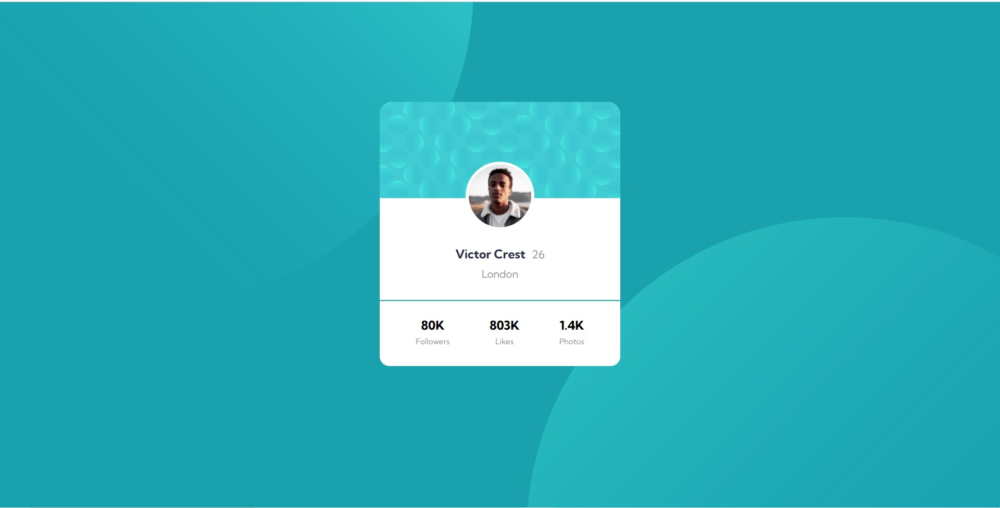
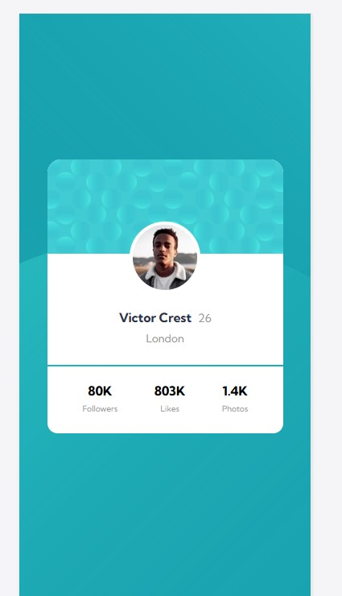

# Frontend Mentor - Profile card component solution

## Table of contents

- [Overview](#overview)
  - [The challenge](#the-challenge)
  - [Screenshot](#screenshot)
  - [Links](#links)
- [My process](#my-process)
  - [Built with](#built-with)
  - [What I learned](#what-i-learned)
  - [Continued development](#continued-development)
- [Author](#author)

## Overview

### The challenge

- using two background image at the same time in the sam container. 
- set the position of the both images used in background.

### Screenshot





## My process

### Built with

- Semantic HTML5 markup
- CSS custom properties
- Flexbox

### What I learned

- how to use multiple background in the same container
- multiple background using short hand 

To see how you can add code snippets, see below:


```css
.proud-of-this-css {
  backhround-image: url(./image1) no-repeat left top, url(./image2) no-repeat right bottom;
}
```

### Continued development

using multiple background like these and develop more webpages like this 


## Author

- Website - [Gourav Rattan](https://www.your-site.com)

